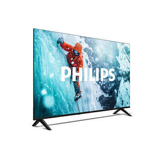
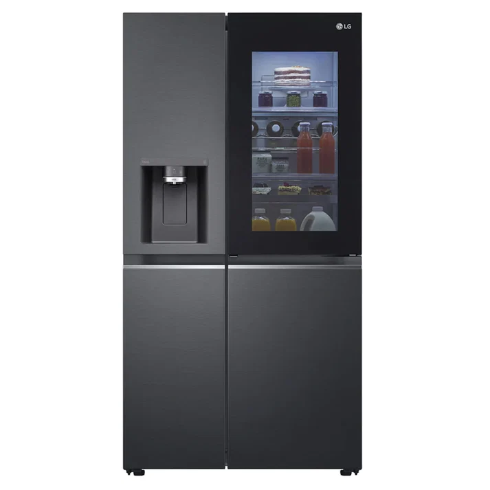

# MyWebsit
<!DOCTYPE html>
<html lang="en">
<head>
  <meta charset="UTF-8">
  <meta name="viewport" content="width=device-width, initial-scale=1.0">

  <title>LG Store | Home Appliances & Electronics</title>

  <meta name="description"
        content="LG Store is your trusted local retailer for LG televisions, home entertainment, fridges, washing machines, air conditioning and small appliances since 2010.">

  <!-- Google Fonts -->
  <link rel="preconnect" href="https://fonts.googleapis.com">
  <link href="https://fonts.googleapis.com/css2?family=Montserrat:wght@600;700&family=Roboto:wght@300;400&display=swap"
        rel="stylesheet">

  <!-- Main CSS -->
  <link rel="stylesheet" href="CSS/Style.css">
</head>

<body>

  <!-- =========================================================
       HEADER / NAVIGATION
  ========================================================== -->

  <header class="site-header">

    

      <a href="#home">LGStore</a>
    

    <nav class="main-nav">

      <a href="#home">Home</a>

      <a href="#about">About Us</a>

      <a href="#products">Products &amp; Services</a>

      <a href="#enquiry">Enquire</a>

      <a href="#contact">Contact</a>

    </nav>

  </header>

  <main>

    <!-- =========================================================
         HOME PAGE
    ========================================================== -->

    <section id="home">

      <!-- HERO -->
      <section class="hero">

        

          <h1>Quality LG Technology for Every Home</h1>

          

            Televisions, home entertainment, fridges, washing machines,
            air conditioning and small appliances — backed by expert
            guidance and trusted after-sales service since 2010.
          

          <a href="#products" class="btn btn-primary">
            Shop Our Range
          </a>

          <a href="#enquiry" class="btn btn-secondary">
            Book a Service
          </a>

        

        

      </section>

      <!-- PRODUCT CATEGORIES -->

      <section class="categories">

        <h2>Shop by Category</h2>

        

          <article class="category-card">

            

            <h3>Televisions</h3>

            

              OLED, QNED and Smart TVs for every room and budget.
            

          </article>

          <article class="category-card">

            

            <h3>Fridges &amp; Freezers</h3>

            

              Energy-efficient cooling solutions for the modern kitchen.
            

          </article>

          <article class="category-card">

            

            <h3>Washing Machines</h3>

            

              Front and top loaders built for South African households.
            

          </article>

          <article class="category-card">

            

            <h3>Air Conditioning</h3>

            

              Split and inverter units for year-round comfort.
            

          </article>

        

      </section>

      <!-- VALUE PROPOSITION -->

      <section class="value-prop">

        <h2>Why Shop With Us</h2>

        <ul>

          <li>
            15+ years as an independently owned LG retailer
          </li>

          <li>
            Knowledgeable, in-store sales specialists
          </li>

          <li>
            Professional installation and after-sales service
          </li>

          <li>
            Genuine LG warranties on every product
          </li>

        </ul>

      </section>

      <!-- TRUST / TESTIMONIAL -->

      <section class="trust">

        <h2>Trusted by Our Community</h2>

        <blockquote>
          "The team helped me choose the right fridge for my family
          and had it delivered the next day."
          — Local customer
        </blockquote>

      </section>

    </section>

    <!-- =========================================================
         ABOUT US PAGE
    ========================================================== -->

    <section id="about">

      <!-- PAGE INTRO -->

      <section class="page-intro">

        <h1>About LG Store</h1>

        

          Independently owned. Locally trusted. LG certified.
        

      </section>

      <!-- HISTORY -->

      <section class="about-section">

        <h2>Our History</h2>

        

          LG Store has been an independently owned retail shop selling
          branded consumer electronics and home appliances from LG
          since 2010. What began as a single showroom has grown into
          a well-known local retailer of televisions, home entertainment
          equipment, fridges, washing machines, air conditioners and
          small appliances — built on knowledgeable, competent sales
          staff and dependable after-sales service.
        

      </section>

      <!-- MISSION AND VISION -->

      <section class="about-section mission-vision">

        <article>

          <h2>Our Mission</h2>

          

            To provide quality entertainment and household technology
            to every household, backed by expert guidance and professional
            after-sales services.
          

        </article>

        <article>

          <h2>Our Vision</h2>

          

            To become the No. 1 choice in the region for LG products,
            as an authority for both our range of products and services
            and our digital consumer experience.
          

        </article>

      </section>

      <!-- TEAM -->

      <section class="about-section team">

        <h2>Meet the Team</h2>

        

          <article class="team-member">

            

            <h3>Store Manager</h3>

            

              Oversees daily operations and product sourcing.
            

          </article>

          <article class="team-member">

            

            <h3>Sales Specialist</h3>

            

              Guides customers to the right product for their home.
            

          </article>

          <article class="team-member">

            

            <h3>Service Technician</h3>

            

              Handles installations, repairs and warranty claims.
            

          </article>

        

      </section>

      <!-- STORE LOCATOR -->

      <section class="about-section store-locator">

        <h2>Find Our Stores</h2>

        

          Visit us in-store — see the
          <a href="#contact">Contact section</a>
          for addresses, hours and directions to both our locations.
        

      </section>

    </section>

    <!-- =========================================================
         PRODUCTS & SERVICES PAGE
    ========================================================== -->

    <section id="products">

      <!-- PAGE INTRO -->

      <section class="page-intro">

        <h1>Products &amp; Services</h1>

        

          Genuine LG products, expert installation and reliable
          after-sales support.
        

      </section>

      <!-- PRODUCT CATALOGUE -->

      <section class="products">

        <h2>Our Product Range</h2>

        <!-- TELEVISIONS -->

        <article class="product-card">

          

          

            <h3>Televisions</h3>

            

              OLED, QNED and standard LED Smart TVs across a range
              of screen sizes.
            

            

              From R 6 999
            

          

        </article>

        <!-- FRIDGES -->

        <article class="product-card">

          

          

            <h3>Fridges &amp; Freezers</h3>

            

              Top-freezer, side-by-side and French-door models with
              InstaView and inverter cooling.
            

            

              From R 9 499
            

          

        </article>

        <!-- WASHING MACHINES -->

        <article class="product-card">

          

          

            <h3>Washing Machines</h3>

            

              Front and top loaders with AI Direct Drive and steam
              wash technology.
            

            

              From R 7 299
            

          

        </article>

        <!-- AIR CONDITIONING -->

        <article class="product-card">

          

          

            <h3>Air Conditioning</h3>

            

              Split and inverter air conditioning units for residential
              and small commercial spaces.
            

            

              From R 8 999
            

          

        </article>

        <!-- SMALL APPLIANCES -->

        <article class="product-card">

          

          

            <h3>Small Appliances</h3>

            

              Microwaves, vacuum cleaners and other everyday
              home essentials.
            

            

              From R 1 199
            

          

        </article>

      </section>

      <!-- SERVICES -->

      <section class="services">

        <h2>Installation &amp; Repair Services</h2>

        

          Our technicians provide professional installation, appliance
          repairs and warranty claim handling for every product we sell.
          Book a service call via our
          <a href="#enquiry">enquiry form</a>
          and our team will confirm availability and cost.
        

      </section>

    </section>

    <!-- =========================================================
         ENQUIRY PAGE
    ========================================================== -->

    <section id="enquiry">

      <!-- PAGE INTRO -->

      <section class="page-intro">

        <h1>Enquiry</h1>

        

          Ask about pricing, availability, or book an installation,
          repair or warranty service.
        

      </section>

      <!-- ENQUIRY FORM -->

      <section class="form-section">

        <form
          action="#"
          method="post"
          id="enquiry-form">

          <!-- FULL NAME -->

          <label for="full-name">
            Full Name
          </label>

          <input
            type="text"
            id="full-name"
            name="full-name"
            required>

          <!-- EMAIL -->

          <label for="email">
            Email Address
          </label>

          <input
            type="email"
            id="email"
            name="email"
            required>

          <!-- PHONE -->

          <label for="phone">
            Phone Number
          </label>

          <input
            type="tel"
            id="phone"
            name="phone"
            pattern="[0-9]{10}"
            placeholder="0821234567"
            required>

          <!-- ENQUIRY TYPE -->

          <label for="enquiry-type">
            Enquiry Type
          </label>

          <select
            id="enquiry-type"
            name="enquiry-type"
            required>

            <option value="">
              -- Select an option --
            </option>

            <option value="product-info">
              Product Information / Pricing
            </option>

            <option value="installation">
              Installation Booking
            </option>

            <option value="repair">
              Repair / Service Booking
            </option>

            <option value="warranty">
              Warranty Claim
            </option>

          </select>

          <!-- PRODUCT CATEGORY -->

          <label for="product-category">
            Product Category
          </label>

          <select
            id="product-category"
            name="product-category">

            <option value="">
              -- Select a category --
            </option>

            <option value="tv">
              Televisions
            </option>

            <option value="fridge">
              Fridges &amp; Freezers
            </option>

            <option value="washer">
              Washing Machines
            </option>

            <option value="aircon">
              Air Conditioning
            </option>

            <option value="small-appliance">
              Small Appliances
            </option>

          </select>

          <!-- MESSAGE -->

          <label for="message">
            Message
          </label>

          <textarea
            id="message"
            name="message"
            rows="5"
            required></textarea>

          <!-- CONTACT METHOD -->

          <fieldset>

            <legend>
              Preferred Contact Method
            </legend>

            <label>
              <input
                type="radio"
                name="contact-method"
                value="email"
                checked>

              Email
            </label>

            <label>
              <input
                type="radio"
                name="contact-method"
                value="phone">

              Phone
            </label>

            <label>
              <input
                type="radio"
                name="contact-method"
                value="whatsapp">

              WhatsApp
            </label>

          </fieldset>

          <!-- SUBMIT -->

          <button
            type="submit"
            class="btn btn-primary">

            Submit Enquiry

          </button>

        </form>

      </section>

    </section>

    <!-- =========================================================
         CONTACT PAGE
    ========================================================== -->

    <section id="contact">

      <!-- PAGE INTRO -->

      <section class="page-intro">

        <h1>Contact Us</h1>

        

          We'd love to hear from you. Visit us, call us,
          or send a message below.
        

      </section>

      <!-- STORE LOCATIONS -->

      <section class="store-locations">

        <h2>Our Stores</h2>

        

          <!-- SANDTON -->

          <article class="location-card">

            <h3>
              LG Store — Sandton
            </h3>

            

              123 Rivonia Road,
              Sandton,
              Johannesburg,
              2196
            

            

              Tel: 011 000 0000
            

            

              Mon–Fri: 08:00–17:00 |
              Sat: 09:00–14:00 |
              Sun: Closed
            

            <iframe
              title="Map showing LG Store Sandton location"
              src="https://maps.google.com/maps?q=Rivonia%20Road%2C%20Sandton%2C%20Johannesburg&output=embed"
              width="100%"
              height="250"
              style="border:0;"
              loading="lazy">
            </iframe>

          </article>

          <!-- CAPE TOWN -->

          <article class="location-card">

            <h3>
              LG Store — Cape Town
            </h3>

            

              45 Bree Street,
              Cape Town City Centre,
              8001
            

            

              Tel: 021 000 0000
            

            

              Mon–Fri: 08:00–17:00 |
              Sat: 09:00–14:00 |
              Sun: Closed
            

            <iframe
              title="Map showing LG Store Cape Town location"
              src="https://maps.google.com/maps?q=Bree%20Street%2C%20Cape%20Town&output=embed"
              width="100%"
              height="250"
              style="border:0;"
              loading="lazy">
            </iframe>

          </article>

        

      </section>

      <!-- CONTACT FORM -->

      <section class="form-section">

        <h2>
          Send Us a Message
        </h2>

        <form
          action="#"
          method="post"
          id="contact-form">

          <!-- NAME -->

          <label for="c-full-name">
            Full Name
          </label>

          <input
            type="text"
            id="c-full-name"
            name="full-name"
            required>

          <!-- EMAIL -->

          <label for="c-email">
            Email Address
          </label>

          <input
            type="email"
            id="c-email"
            name="email"
            required>

          <!-- PHONE -->

          <label for="c-phone">
            Phone Number
          </label>

          <input
            type="tel"
            id="c-phone"
            name="phone"
            pattern="[0-9]{10}"
            placeholder="0821234567">

          <!-- MESSAGE TYPE -->

          <label for="c-subject">
            Message Type
          </label>

          <select
            id="c-subject"
            name="subject"
            required>

            <option value="">
              -- Select an option --
            </option>

            <option value="general">
              General Enquiry
            </option>

            <option value="feedback">
              Feedback / Complaint
            </option>

            <option value="careers">
              Careers
            </option>

            <option value="other">
              Other
            </option>

          </select>

          <!-- MESSAGE -->

          <label for="c-message">
            Your Message
          </label>

          <textarea
            id="c-message"
            name="message"
            rows="5"
            required></textarea>

          <!-- SUBMIT -->

          <button
            type="submit"
            class="btn btn-primary">

            Send Message

          </button>

        </form>

      </section>

    </section>

  </main>

  <!-- =========================================================
       FOOTER
  ========================================================== -->

  <footer class="site-footer">

    <!-- COMPANY -->

    

      <h3>LG Store</h3>

      

        Your local authority on LG products
        and service since 2010.
      

    

    <!-- QUICK LINKS -->

    

      <h3>Quick Links</h3>

      <a href="#home">
        Home
      </a>

      <a href="#about">
        About Us
      </a>

      <a href="#products">
        Products &amp; Services
      </a>

      <a href="#enquiry">
        Enquire
      </a>

      <a href="#contact">
        Contact
      </a>

    

    <!-- CONTACT -->

    

      <h3>Contact</h3>

      

        Tel: 08 146 28415
         
        Email: info@lgstore.co.za
      

    

    <!-- COPYRIGHT -->

    

      &copy; 2026 LG Store.
      All rights reserved.

    

  </footer>

</body>
</html>
